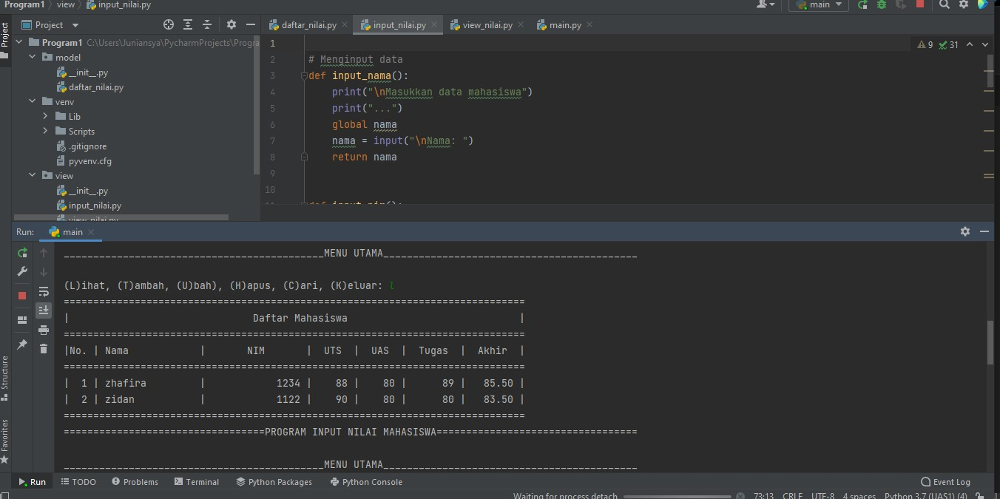

# UAS

### NAMA   : Zhafira Abadiningrum Khafianti
### KELAS : TI.21.A.1
### NIM    : 312110067
### MATA KULIAH: BAHASA PEMROGRAMAN

#### Berikut Struktur Package & Modul

### Model

    daftar_nilai
    
    -tambah data
    
    data = {} untuk menampung list data yang nanti akan terinput
    deklarasikan fungsi def tambah_data():
    nama = input("Masukan nama: ") lalu tambahkan input nama, nim, nilai tugas, uts, uas
    nilai_akhir = (nilai_tugas)*30/100 + (nilai_uts)*35/100 + (nilai_uas)*35/100 untuk nilai akhir diambil dari perhitungan 3 komponen nilai (nilai_tugas: 30%, nilai_uts: 35%, nilai_uas: 35%)
    data[nama] = [nama, nim, nilai_tugas, nilai_uts, nilai_uas, nilai_akhir] kita akan masukkan data yang tadi kita input ke dalam `data[nama]'
    lalu cetak print()
    -Ubah data
    
    deklarasikan fungsi def ubah_data():
    
    nama = input("Masukan nama untuk mengubah data: ") kita akan menginput data yang nanti akan di ubah
    
    if nama in data.keys(): print("Mau mengubah apa?") jika 'nama' dari di dalam 'data' maka akan mengembalikan daftar menggunakan fungsi 'keys()' lalu di cetak lah 'print()'
    
    sub_data = input("(Semua), (Nama), (NIM), (Tugas), (UTS), (UAS) : ") membuat menu ubah di dalam sub_data
    
    if sub_data.lower() == "semua": ambil kata kunci 'semua' di dalam sub_data jika 'semua' maka input data[nama][1] = input("Ubah NIM:") data[nama][2] = int(input("Ubah Nilai Tugas: ")) data[nama][3] = int(input("Ubah Nilai UTS: ")) data[nama][4] = int(input("Ubah Nilai UAS: "))
    
    data[nama][5] = data[nama][2] *30/100 + data[nama][3]*35/100 + data[nama][4] *35/100 kita dapatkan nilai akhir dengan diambil dari perhitungan 3 komponen nilai (tugas: 30%, uts: 35%, uas: 35%), ket: [5] = nilai_akhir, dimana [0] = nama
    
    lalu cetak print("\nBerhasil ubah data!")
    
    Jika kita ingin mengubah data tertentu maka elif sub_data.lower() == "nim": data[nama][1] = input("NIM:") dan berlaku juga untuk nilai tugas, UTS dan UAS
    
    lalu cetak print("\nBerhasil ubah data!")
    
    else: print("'{}' tidak ditemukan.".format(nama)) jika kita salah dalam memasukkan nama untuk mengubah data maka akan muncul 'nama tidak di temukan'
    
    -Cari data
    
    deklarasikan fungsi def cari_data():
    nama = input("Masukan nama untuk mencari data: ") kita akan menginput data yang nanti akan di cari
    if nama in data.keys(): kita mengambil list 'nama' di dalam 'data' menggunakan pengkondisian
    maka cetak print("| {0:14} | {1:9} | {2:5} | {3:5} | {4:5} | {5:5}" .format(nama, data[nama][1], data[nama][2], data[nama][3], data[nama][4], data[nama][5])) untuk menampilkan data yang tersedia
    else: print("'{}' tidak ditemukan.".format(nama)) jika data yang kita input salah/tidak ditemukan maka akan tercetak 'nama tidak di temukan'
    -Hapus data
    
    deklarasikan fungsi def hapus_data():
    nama = input("Masukan nama untuk menghapus data : ") kita akan menginput data yang nanti akan di hapus
    if nama in data.keys(): kita mengambil list 'nama' di dalam 'data' menggunakan pengkondisian
    del data[nama] hapus semua 'nama' yang ada di dalam 'data'
    jika sudah maka cetak print("sub_data '{}' berhasil dihapus.".format(nama))
    else: print("'{}' tidak ditemukan.".format(nama)) jika data yang kita input salah/tidak ditemukan maka akan tercetak 'nama tidak di temukan'

#### View

    input_nilai
    
    menambahkan fungsi input yang nanti nya akan di deklarasikan di setiap module nya, def input_nama(): def input_nim(): dan yg lainnya, yang nanti akan di masukkan kedalam data={}
    view_nilai
    
    deklarasikan fungsi def lihat_data(): Kita menggunakan kondisi percabangan if, ambil data dari data
    lalu cetak print()
    Lalu yang terakhir kita eksekusi file main.py

## File
   from model.daftar_nilai import *
from view.view_nilai import *

# Mulai
print("===============================================================")
print("|                           Program 1                         |")
print("===============================================================")

while True:
    print("\n")
    menu = input("(L) Lihat, (T) Tambah, (H) Hapus, (U) Ubah, (C) Cari, (K) Keluar\nPilih menu: ")
    print("\n")

    # menu
    if menu.lower() == 't':
        tambah_data()

    elif menu.lower() == 'c':
        cari_data()

    elif menu.lower() == 'l':
        lihat_data()

    elif menu.lower() == 'u':
        ubah_data()

    elif menu.lower() == 'h':
        hapus_data()

    # Keluar
    elif menu.lower() == 'k':
        break

    else:
        print("ada yang salah, silahkan cek kembali.")

### OUTPUT

Tambah Data

Lihat data

Ubah Data

Cari Data

Hapus Data

### TERIMAKASIH